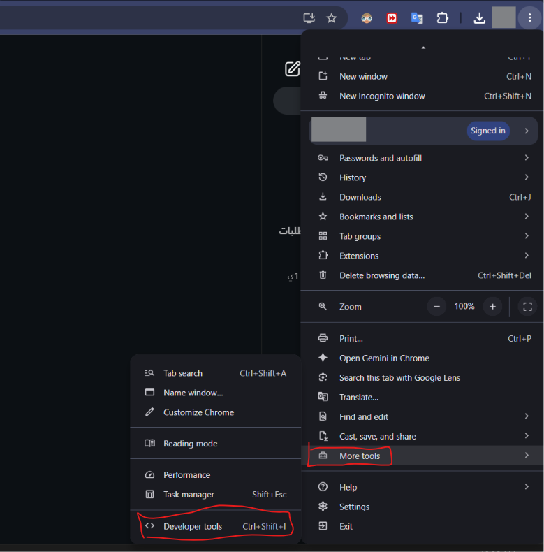

# ss

## Instagram DM Bulk Unsender

A simple Python script that unsends messages sent by your account from Instagram DM conversations.

When a message is successfully unsent, it disappears from the conversation for both sides. The script cannot remove messages sent by the other person.

> **Important:** This project uses Instagram's unofficial private API through `instagrapi`. Instagram may change its systems at any time, and automated activity may cause rate limits, verification challenges, temporary restrictions, or account suspension.
>
> <mark style="color:$danger;">**Using unofficial automated access may violate Instagram's Terms of Use, regardless of the selected speed settings.**</mark>

### How it works

1. Run the script.
2. Paste the `sessionid` for an Instagram account you own.
3. The script signs in and fetches the available DM threads.
4. Choose one of the following:
   * `A` to process every fetched conversation.
   * A number such as `3` to select a conversation from the list.
   * A username from the displayed thread list to select that conversation.
   * A numeric Thread ID to process it directly.
5. The script scans the selected conversation and unsends messages sent by your account.

The screenshot uses fictional usernames and Thread IDs. The session ID is intentionally hidden.

### Installation

```bash
git clone https://github.com/YOUR_USERNAME/instagram-dm-bulk-unsender.git
cd instagram-dm-bulk-unsender
pip install -r requirements.txt
```

### How to get your sessionid

> **Warning:** Your `sessionid` is a sensitive login credential.\
> Anyone who has it may be able to access your Instagram account. Only use your own session ID, and never share or upload it anywhere.

#### Chrome, Edge, or Brave

1. Sign in to [Instagram](https://www.instagram.com/) using your browser.
2. Open Developer Tools by pressing `F12` or `Ctrl + Shift + I`.

<figure><figcaption></figcaption></figure>

1. Open the **Application** tab.

<figure><figcaption></figcaption></figure>

1. Under **Storage**, expand **Cookies**.
2. Select `https://www.instagram.com`.
3. Search for a cookie named `sessionid`.

<figure><figcaption></figcaption></figure>

1. Copy only the content inside the **Value** column.
2. Run the script and paste the value when prompted.

```
Paste your Instagram sessionid: YOUR_SESSION_ID
```

### Run

```bash
python unsend.py
```

#### Examples

Choose the third conversation:

```
Your choice: 3
```

Process every conversation shown in the list:

```
Your choice: A
```

Search by username:

```
Your choice: example_user
```

Use a Thread ID directly:

```
Your choice: 340282366841710300000000000000000000000
```

Although the menu shows `U` and `ID`, the current script expects the actual username or Thread ID in the same `Your choice` field. Do not enter only `U` or only `ID`.


### Speed settings

The script includes these settings near the top:

```python
MIN_SLEEP = 0.3
MAX_SLEEP = 0.3
BATCH_SIZE = 100
LONG_PAUSE = 1
PAGE_SIZE = 50
```

What they control:

| Setting      | What it changes                                       |
| ------------ | ----------------------------------------------------- |
| `MIN_SLEEP`  | Minimum delay between unsend requests                 |
| `MAX_SLEEP`  | Maximum delay between unsend requests                 |
| `BATCH_SIZE` | Number of unsend attempts before a longer pause       |
| `LONG_PAUSE` | Length of the pause after each batch                  |
| `PAGE_SIZE`  | Number of messages requested from Instagram per fetch |

#### Faster is not always better

The default values are already fast.

Reducing the delays, increasing the batch size, or shortening the long pause may make the script finish faster, but it may also increase the chance of:

* Rate limits
* Login or verification challenges
* Temporary action blocks
* Account restrictions
* Account suspension

There is no setting that guarantees safety. Instagram does not publish a reliable limit for this type of unofficial automation.

**Any speed changes are made at your own risk.** Test changes on a secondary account first.

A safer direction is usually:

* Increase `MIN_SLEEP` and `MAX_SLEEP`
* Reduce `BATCH_SIZE`
* Increase `LONG_PAUSE`

`PAGE_SIZE` mainly affects how many messages are fetched in each request. It is not the same as the delay between unsend actions.

### Before using it

* Test the script on a secondary account and an unimportant conversation first.
* The script starts immediately after you select a target and does not ask for final confirmation.
* Do not start with the `A` option.
* Treat unsend operations as permanent.
* Never share, upload, or include your `sessionid` in screenshots or source code.
* If your session ID is exposed, sign out of active sessions, change your password, and review your login activity.

### Tested environment

* Windows 11
* Python 3.10
* `instagrapi` 2.4.4

### Tested environment and behavior

Tested on Windows 11 with Python 3.10 and `instagrapi` 2.4.4.

The script has been tested for:

* Logging in with a valid session ID
* Fetching and selecting DM threads
* Processing one conversation or all displayed conversations
* Unsending messages sent by the authenticated account
* Running continuously for up to 6 hours

### Not verified yet

The following have not been fully tested:

* Speeds higher than the default settings
* Runs longer than 6 hours
* Conversations containing more than 7,000 messages
* Recovery after an interruption or internet disconnection
* Exact bandwidth usage
* The exact risk of account restrictions or suspension, including whether reports from other users may affect the account
* Compatibility with future Instagram API changes

### Known limitations

* It only unsends messages sent by the logged-in account.
* It cannot remove messages sent by another participant.
* If you previously deleted the entire conversation from your Instagram inbox, the script cannot access its old messages or unsend them for all participants.
* Unsent messages may remain visible for a limited time in some unofficial or modified Instagram apps that cache deleted messages.
* Message requests, hidden conversations, or threads in a separate General inbox may not be included.
* Some unsupported or system-generated items may be skipped.
* A completed run does not guarantee that every eligible message was removed. Review the terminal for errors and check the conversation manually afterward.
* Username selection works by searching the fetched thread list. The fallback lookup may not work for every username.
* Instagram may change its private API without notice.

### Responsible use

Use this project only with an account you own or are explicitly authorized to manage.

Do not use it to access another person's account, hide abuse, destroy evidence, evade an investigation, harass users, or interfere with accounts you do not control.

### Disclaimer

This project is not affiliated with, endorsed by, or supported by Instagram or Meta.

Use it at your own risk. The author is not responsible for lost messages, rate limits, checkpoints, restrictions, suspension, or other account consequences.
