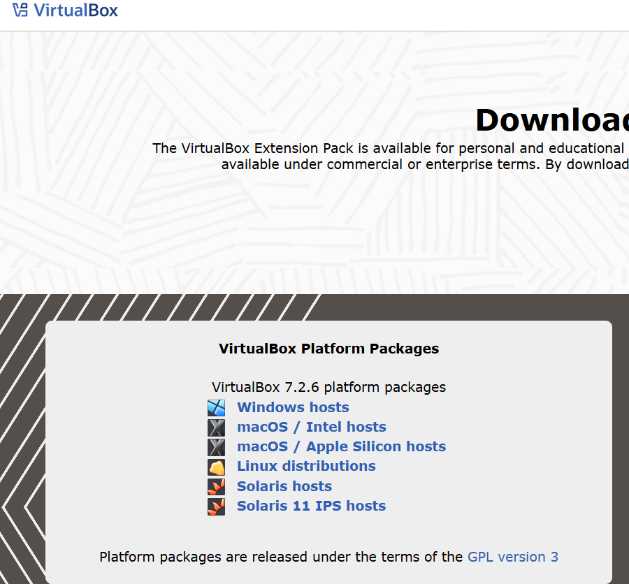

# VirtualBox & kali Install and Preparation

### 1- VirtualBox installation:

[Link:](https://www.virtualbox.org/wiki/Downloads)

**Choose the platform packages for your OS.**

<figure><figcaption></figcaption></figure>

Make sure you selected **"VirtualBox Application".**

<figure><figcaption></figcaption></figure>

### 2- Kali Linux Install :&#x20;

[link:](https://www.kali.org/get-kali/#kali-virtual-machines)

Choose the version that matches your virtualization software (e.g., **VirtualBox** or **VMware**).

Click the download icon to start downloading the file.

<figure><figcaption></figcaption></figure>

**After extracting the compressed file, you will find two files inside the folder: a .vbox file and a .vdi file.**

<figure><figcaption></figcaption></figure>

Open VirtualBox and import the Kali Linux virtual machine

Click on Machines ⇒ New 

<figure><figcaption></figcaption></figure>

**Write the name of the machine and select:**

* **OS:** Linux
* **OS Distribution:** Debian
* **OS Version:** Debian (64-bit)

<figure><figcaption></figcaption></figure>

**For specifying virtual hardware:**

* **Base Memory (RAM):** 2 GB is Minimal.
* **Number of CPUs:** 3–4 CPUs are enough.


**Note:** These are the standard requirements for smooth operation of the OS. If you want to allocate more resources, do **not exceed the green bar** in the VirtualBox/VMware settings.


<figure><figcaption></figcaption></figure>

**If you want to change the location where the virtual machine will store its disk, click on the folder/file icon.**

**The minimal disk size should be between 8 GB and 20 GB.**


**Note:** If you have extended storage, it is recommended to use it for the virtual machine's hard disk.


<figure><figcaption></figcaption></figure>

After you finish , right click on your machine and press settings.

<figure><figcaption></figcaption></figure>

Go to **Display** and change Video Memory from 16 to 128 MB.

<figure><figcaption></figcaption></figure>

Now go to Storage ⇒ Controller: IDE then press this icon.

<figure><figcaption></figcaption></figure>

Select **"Add"**, then navigate to the folder where you extracted the compressed file and select the Kali Linux .vdi file.&#x20;

<figure><figcaption></figcaption></figure>

After starting the virtual machine, log in using the username `kali` and the password `kali`.

<figure><figcaption></figcaption></figure>

### 3- Download other Linux distribution

&#x20; [Metasploitable 2](https://sourceforge.net/projects/metasploitable/) 

Ubuntu

[Link:](https://ubuntu.com/download/desktop)

Metasploitable 2

[Link:](https://sourceforge.net/projects/metasploitable/)

#### How to Save your Password:

I recommend using the **Description** feature in VirtualBox and VMware to safe the passwords

**VirtualBox :**&#x20;

Click on the VM -> Settings -> General -> Description

<figure><figcaption></figcaption></figure> <figure><figcaption></figcaption></figure>

#### VMware :&#x20;

<figure><figcaption></figcaption></figure>

